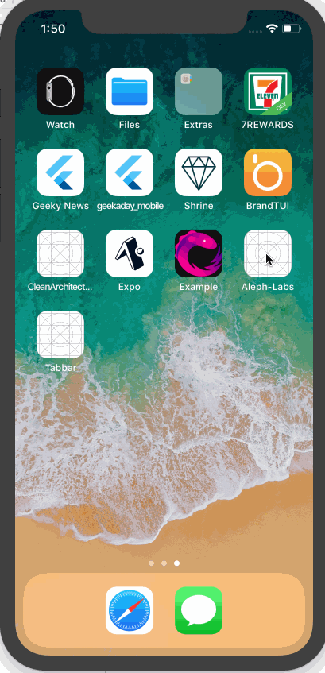

#  Aleph Assignment Project

## Description

This project is a coding assignment from Aleph lab. 

## Requirements

Develop the following with best use of iOS Technologies for iOS phones. Target iOS version will be 11.0 and above. You can refer to the attached sample video.

• Use storyboard/xib for UI part
• Swift/Objective-C preferable
• Launch the application "Apple" should select as default and the items should animate one by one as per the video
• Click on "Android" the existing list should animate and removed. New list should animate one by one as per the video
• Focus more on the Animation part

Note: Use the following links to download data and images from server asynchronously

• http://dev.aleph-labs.com/ios_assignment/apple.json
• http://dev.aleph-labs.com/ios_assignment/android.json

## Architecture
MVVM + RxSwift

## Dependencies
RxSwift + RxCocoa

## Build
1. Run `pod install`
2. Open `Thien Assignment.xcworkspace`
3. Run project on Simulator/ Real Device

## User Stories
1. User can see Home Screen contain Product List.
2. User can select either Apple or Android category.
3. User can see animation when item is appeared.

## Demo

Here's a walkthrough of implemented user stories:

## Notes
1. Should implement item disappearing animation.
2. Test cases should be filled on viewModel.

## License

Copyright [2018] [Thien Nguyen]

Licensed under the Apache License, Version 2.0 (the "License");
you may not use this file except in compliance with the License.
You may obtain a copy of the License at

http://www.apache.org/licenses/LICENSE-2.0

Unless required by applicable law or agreed to in writing, software
distributed under the License is distributed on an "AS IS" BASIS,
WITHOUT WARRANTIES OR CONDITIONS OF ANY KIND, either express or implied.
See the License for the specific language governing permissions and
limitations under the License.

